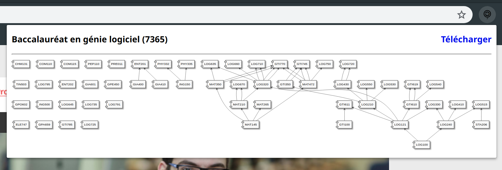

# Générateur d'arbre des cours de l'ÉTS - Par CEDILLE

Pour utiliser l'extension il faut l'installer dans un navigateur compatible avec des extensions web (Firefox, Chrome, etc).

Lien des extensions :

[Firefox](https://addons.mozilla.org/en-CA/firefox/addon/ets-courses/)

[Chrome](https://chrome.google.com/webstore/detail/éts-courses-par-cedille/gaikidefhpnlakilioodiiflhinkkdma)

## Pour générer un graphe il faut se rendre sur la page du programme

Par exemple :
https://www.etsmtl.ca/Programmes-Etudes/1er-cycle/Bac/7365

Puis il faut cliquer sur l'icone de CEDILLE dans la barre du navigateur.

